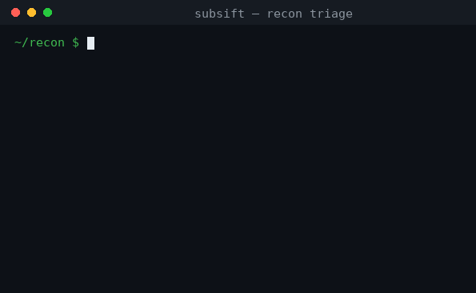

# subsift

[](https://github.com/Dry1ceD7/subsift/actions/workflows/ci.yml)
[](LICENSE)
[](pyproject.toml)

**Sift signal from subdomain-recon noise.** Pipe in `subfinder`/`amass`/`httpx` output and get back a de-noised, tagged, priority-scored view of what's actually worth looking at — non-prod, admin, auth, API, CI/CD, infra, payment — while the ephemeral CI previews, wildcard-DNS junk, and numbered white-label pages get dropped.

Pure Python **stdlib, zero dependencies**. One file. Reads a file or stdin.

```bash
subfinder -d target.com -silent | subsift --interesting
```



---

## The problem

Passive enumeration on a big target returns thousands of hosts. Most are noise:
per-PR preview deploys (`2871-fix-uncover.ci0.dev.example.com`), build-hash labels,
wildcard-DNS pollution, and thousands of numbered white-label sites
(`10441.partner.example.com`). Finding the handful that matter — `admin.*`, `*.dev`,
`gitlab.*`, `api-payments-*` — is slow, manual `grep` archaeology.

`subsift` does that triage in one pass.

## What it does

- **Drops noise** — ephemeral/preview deploys, hash/uuid labels, embedded-domain wildcard junk, over-nested artifacts.
- **Collapses** numbered white-label sprawl (keeps a couple, counts the rest).
- **Tags** each host with its environment (`dev/test/staging/uat/qa/sandbox/rc/internal`) and categories (`admin, auth, api, cicd, monitoring, infra, data, payment, storage, mail`).
- **Scores** by bug-bounty interest so the good stuff floats to the top.

### Real example — 10,886 subdomains in, the good stuff out

```text
$ subsift justeat-subs.txt --stats >/dev/null
[subsift] kept 6917 hosts; dropped 3969 noise
          ({'deep-nesting':1486,'ephemeral-preview':1560,'hash-label':902,...})

$ subsift justeat-subs.txt --interesting --min-score 5
 10  docker-registry.dev.pyszne.pl        [dev, cicd, infra]
 10  gitlab-ssh.dev.pyszne.pl             [dev, cicd, infra]
  9  g-admin-api.dev.lieferando.de        [dev, admin, api]
  8  kubernetes.auth.lieferando.de        [auth, infra]
  8  vpn.auth.lieferando.de               [auth, infra]
  7  admin.api-courier.skipthedishes.com  [admin, api]
  7  api-payments-secure-prod.skippay...  [api, payment]
  7  internal-k8s.scoober.com             [internal, infra]
```

## Install

No dependencies — just grab the file:

```bash
curl -O https://raw.githubusercontent.com/Dry1ceD7/subsift/main/subsift.py && chmod +x subsift.py
```

or install it:

```bash
pip install subsift        # once published
# or from source:
pip install .
```

## Usage

```text
subsift [FILE] [options]        # FILE or stdin

--interesting        only hosts with score >= --min-score, sorted high→low
--min-score N        threshold for --interesting (default 2)
--json               emit JSON lines with tags + score (feed the next tool)
--stats              print an env/category/noise breakdown
--httpx              input is httpx JSON lines (reads the url/input field)
--keep-noise         don't drop anything, just tag
--collapse N         keep at most N numbered white-label hosts per parent (default 2)
```

### Recipes

```bash
# passive enum → only the interesting hosts → probe those
subfinder -d target.com -silent | subsift --interesting | awk '{print $2}' | httpx -silent

# tag httpx output and keep the JSON for later
httpx -l subs.txt -json | subsift --httpx --json > tagged.jsonl

# just the non-prod + admin/auth/infra surface, with a breakdown
subsift subs.txt --stats | grep -E 'admin|auth|infra|cicd|payment'
```

## Scoring (tunable)

Interest is a small weighted sum: high-value categories (`admin`, `auth`,
`payment`, `infra`, `cicd`, `data`) score highest, `api`/`monitoring` next,
non-prod environments get a bonus (weaker auth = better odds), and plain
`storage`/`cdn` is penalised. Everything lives in dicts at the top of
`subsift.py` — edit them to taste.

## Scope & ethics

`subsift` only reads and classifies hostnames you already have — it makes **no
network requests**. Use it inside authorized engagements (bug-bounty scope, your
own assets) and follow each program's rules.

## Contributing

Patterns are never complete — PRs that add environment tokens, category keywords,
noise rules, or public suffixes are very welcome. Add a case to `tests/` with it.

## License

MIT — see [LICENSE](LICENSE).
